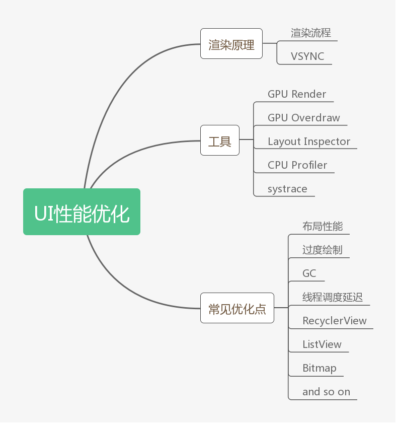
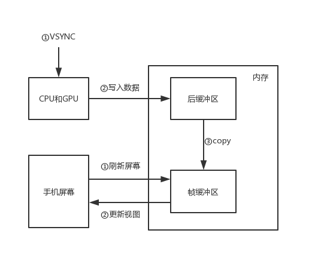
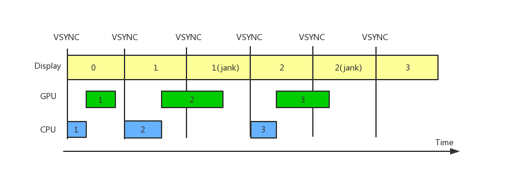
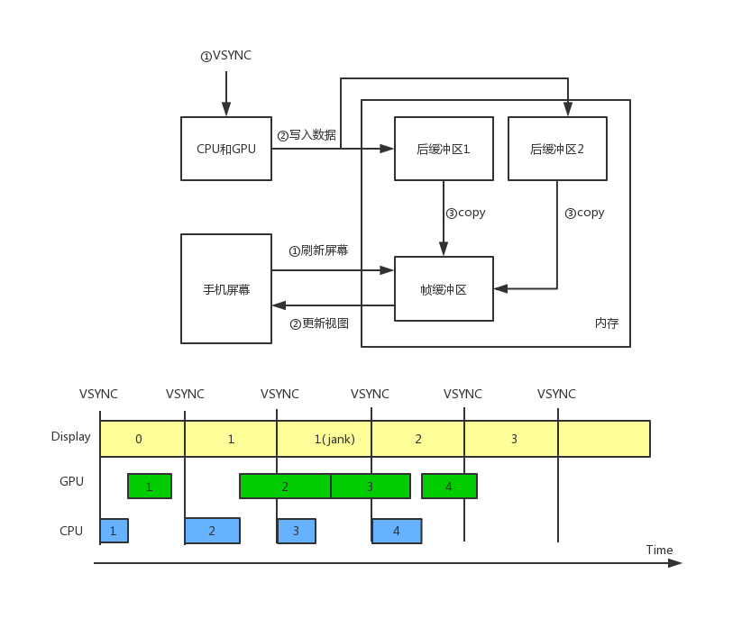
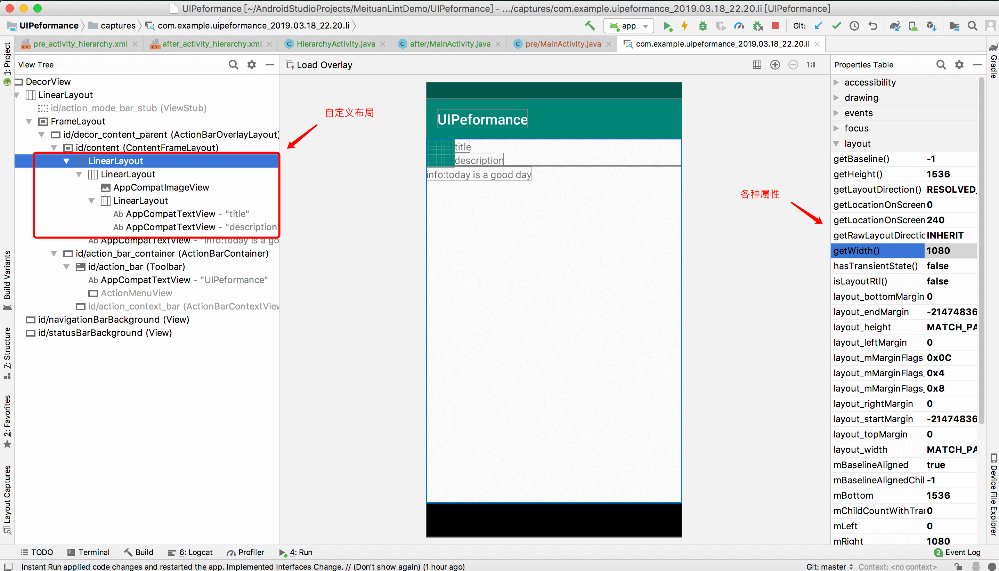
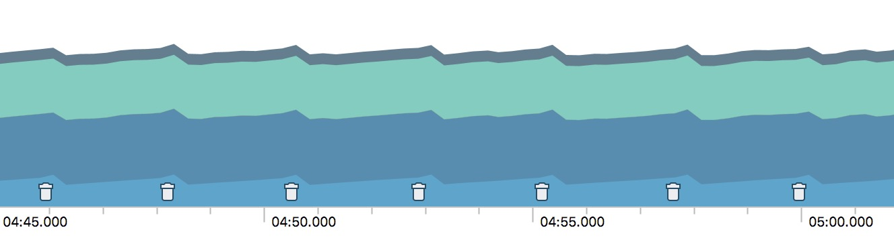
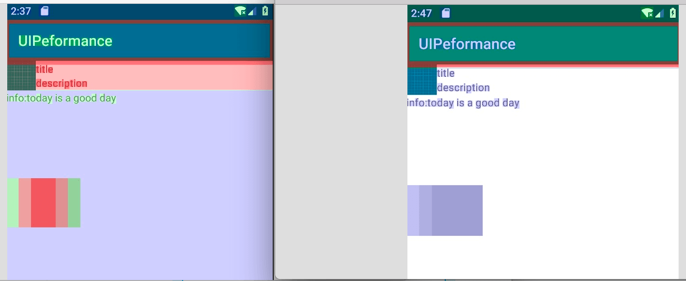
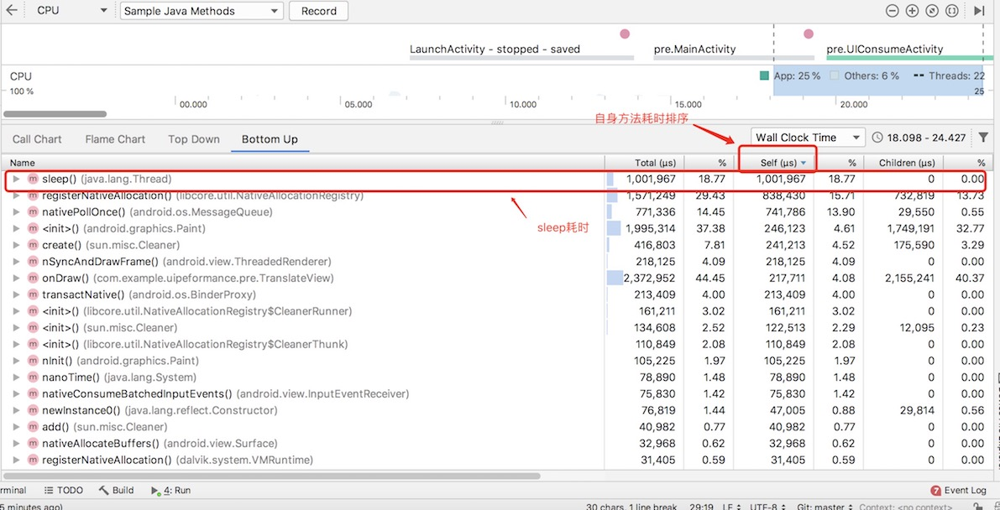
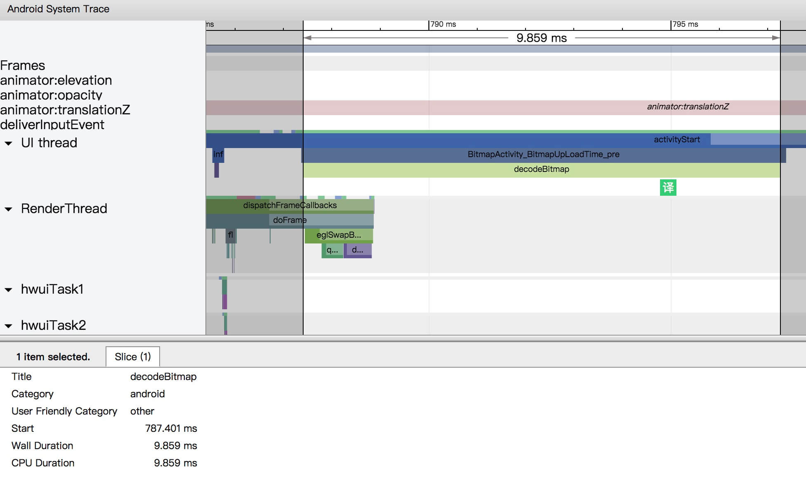
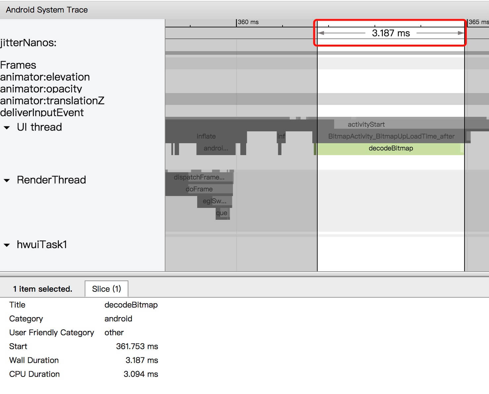

# UI性能优化

> 文章来源：MasteringAndroid
>
> 作者：孙祥磊
>
> 审阅者：程序亦非猿
>
> 贡献者：


[TOC]

## 一、知识简介

### 1. 导图



### 2. 渲染原理

**渲染流程**

渲染操作依赖于两个核心组件：CPU和GPU。CPU主要负责Measure、Layout、Record、Execute等计算操作，GPU负责Rasterization(栅格化)操作。

复杂的XML布局文件是如何被识别并绘制出来的？首先CPU会把UI组件计算成Polygons(多边形)、Texture(纹理)，它们都会保存到 DisplayList(GPU能识别的数据信息) 中，然后 CPU 将 DisplayList 上传到 GPU 中，前两个步骤是比较耗时的，接着 GPU 进行栅格化(将数据信息转化为一个个像素点并显示到图上)操作。以上是整体的流程，还需要配合屏幕刷新和 VSYNC 垂直同步。

**VSYNC原理**

UI性能本质上是渲染性能，我们所遇到卡顿问题原因有很多，但其根源就是渲染时发生了丢帧。要理解丢帧需要搞清楚三个概念：

- 屏幕刷新率：屏幕在一秒内刷新屏幕的次数，这取决于硬件的固定参数，一般为60hz。
- 帧率：GPU 在一秒内绘制操作的次数，如60fps。
- VSYNC：垂直同步，通知 CPU/GPU 开始绘制下一帧，用于控制帧速率与屏幕刷新速率一样，避免「画面撕裂」。

屏幕刷新率为 60hz 表示 16ms 就会执行一次刷新，若想要每次刷新我们都能看到不一样的绘制视图，那么就必须得保证帧率至少为 60fps，这样每一帧绘制时间都在 16ms 以下。帧率比这个屏幕刷新率大并不影响流畅度，因为 VSYNC 就是为控制帧率过快而存在的。而帧率比 60fps 小，那么就有可能让人感觉到卡顿，因为屏幕刷新了好几次，而画面一直不变。我们先理解下 VSYNC 和缓冲区的协作：



当 ①屏幕刷新信号 到时会从帧缓冲区取出一帧绘制数据渲染到屏幕上②更新视图，此时 ①VSYNC 信号会通知 CPU/GPU 开始 ②写入下帧数据 到后缓冲区（这里就能解释为什么帧率大于屏幕刷新率时可以控制为速率相等，因为即使一帧数据早已绘制完成，但下一帧的绘制必须等 VSYNC 信号到来才可以开始绘制），当后缓冲区在 16ms 内写入完成，这时就会将后缓冲区内的数据复制到帧缓冲区，帧缓冲区等待屏幕刷新信号来临。

可是并不是每次都可以在 16ms 时间内从后缓冲区复制到帧缓冲区的，当某帧在 16ms 后依然在绘制，此时 VSYNC 信号来临，发现无法让下帧开始绘制，因此这次 VSYNC 信号是无效的，必须等到该帧写入后缓冲区结束后复制到帧缓冲区，这之后的 VSYNC 信号才有效，而这过程就丢帧了。



1. Display 表示屏幕，开始时它展示第 0 帧数据，第一个 VSYNC 信号已经通知 CPU/GPU 开始写入第一帧数据到后缓冲区（绘制数据是先由 CPU 计算数据然后再由 GPU 渲染数据）。
2. 第二个 VSYNC 信号到来，Display 会从帧缓冲区获取数据并渲染到屏幕，同时会通知 CPU/GPU 开始写入第二帧数据到后缓冲区。
3. 第三个 VSYNC 信号到来，这时发现第二帧还在写入，并不会通知第三帧开始写入，此时屏幕刷新获取的帧缓冲区数据还是第一帧数据。
4. 第四个 VSYNC 信号到来，这时第二帧早已写入到后缓冲区并且已经复制到帧缓冲区，所以屏幕刷新获取到第二帧的数据，并且开始绘制之前未绘制的第三帧。

我们可以看到 CPU 可能早已完成计算，这时 GPU 还未完成绘制，这个时候 VSYNC 到来是无效的，这浪费了 CPU 的空闲时间，因此 google 引入了三缓冲机制。



Tripple Buffer三缓冲机制增加了一个后缓冲区（两个后缓冲区内部应该是以队列的形式存储，这样不会让帧顺序乱掉），三缓冲的优势是能充分利用 CPU 的空闲时间。

1. 开始时它展示第 0 帧数据，第一个 VSYNC 信号已经通知 CPU/GPU 开始写入第一帧数据到后缓冲区1。
2. 第二个 VSYNC 信号到来，Display 会从帧缓冲区获取数据并渲染到屏幕，同时会通知 CPU/GPU 开始写入第二帧数据到后缓冲区1。
3. 第三个 VSYNC 信号到来，这时发现第二帧 GPU 还在写入，此时屏幕刷新获取的帧缓冲区数据还是第一帧数据，但这时和双缓冲机制不同的是第三帧 CPU 开始写入后缓冲区2。
4. 第四个 VSYNC 信号到来，这时第二帧已全部写入到后缓冲区1并且已经复制到帧缓冲区，所以屏幕刷新获取到第二帧的数据，并且开始绘制第四帧。
5. 第五个 VSYNC 信号到来展示第三帧，与双缓冲相比，这里不会再发生 jank。

**总之就一句话，UI性能问题就是卡顿，而卡顿的原因就是在 16ms 内没有完成一帧的绘制，我们需要找到没有在 16ms 内完成绘制的原因。**

## 二、相关检测工具

### 1. GPU Rendering

[GPU Rendering 官方文档介绍](<https://developer.android.com/studio/profile/inspect-gpu-rendering>)

官方文档已经介绍的很清楚了，简单说下我对6.0 系统以上颜色的理解（官方解释的都比较专业，晦涩难懂）：

- 墨绿色：表示应用执行两个连续帧之间的操作所花的时间。 在硬件渲染原理小节中有提到过，每一帧都是要由 VSYNC 信号通知才会开始渲染，但事实上并不是 VSYNC 信号来到后就马上开始渲染的，若此时 UI 线程在做一些耗时操作占用着线程资源，那么是需要等其完成后才会开始渲染。因此只要是耗时计算或操作尽量放到子线程去做。

- 深绿色：表示应用执行输入 Event 回调中的代码所花的时间。如用户点击一个 Button，我们在 Button 的 onClick 方法内做了太耗时的操作，这时就可以考虑将其放到工作线程。

- 绿色：表示评估运行该帧的所有动画程序所花的时间。这应该比较好理解，动画太耗时了，需要优化。

- 淡绿色：表示在视图层次结构中的 [onLayout](https://developer.android.com/reference/android/view/View.html#onLayout(boolean,%20int,%20int,%20int,%20int)) 和 [onMeasure](https://developer.android.com/reference/android/view/View.html#onMeasure(int,%20int)) 回调上所花的时间。测量/布局太耗时，这步的优化主要就是减少布局层级。

- 蓝色：表示用于创建和更新视图显示列表的时间。说明你写的自定义View需要优化了，onDraw 方法内太耗时。

- 淡蓝色：表示将位图信息上传到 GPU 所花的时间。以图片为主的应用可能这段会长一些，要做好 Bitmap 的压缩工作，异步加载 Bitmap 等。

- 红色和橙色：总体来说这是硬件决定的，不同手机花费的时间是不一样的。这两块的耗时长短取决于视图的复杂度，一般越大型的应用视图越复杂，只要注重其他优化点，这两块耗时自然也会相应减少些。

**GPU Render 使用很简单，一般情况下开启后定位到问题的大致方向即可。**

### 2. GPU Overdraw

[GPU Overdraw 官方文档介绍](<https://developer.android.com/studio/profile/inspect-gpu-rendering>)

**GPU Overdraw 很明确的告诉你哪个部分过度绘制了，解决此类问题套路相对比较固定。**

### 3. Layout Inspector

[Layout Inspector 官方文档](https://developer.android.com/studio/debug/layout-inspector)

**Layout Inspector 除了能看到布局层级，还能看到各个控件的属性，尤其对动态布局的页面来说是个利器。**

### 4. CPU Profiler

[CPU Profiler 官方文档](<https://developer.android.com/studio/profile/cpu-profiler.html?hl=zh-cn>)

**CPU Profiler 能定位到具体方法耗费的时间，一些明显的耗时方法是可以用此工具定位的，但由于它运势时的开销很大，可能会造成误报，因此想要体验真实的卡顿还是得使用systrace。**

### 4. systrace

[systrace 官方文档](<https://developer.android.com/studio/command-line/systrace>)

**systrace 有着非常小的运行时开销，在分析问题的时候能体验到真实的卡顿。它其实解决卡顿真正的利器，因为 CPU Profiler 运行时开销很大，导致无法还原真实的卡顿。但其缺点也比较明显，不能很明确的定位在某个方法，大多数情况下只能先定位大概然后由你去判断，在你怀疑的地方自定义trace marker。**


**性能优化更多的是借助于工具去查找，熟练使用工具是非常重要的，所有性能问题都是通过工具检测的，不过有些人总结了常见的一些 UI 性能问题，并且给出了对应的解决方法。**

## 三、常见优化点

根据我已知的一些优化点结合工具的使用，写了对应的示例代码：[UIPerformance](https://github.com/sunxianglei/UIPerformance)，Demo 简单的写了优化前和优化后的示例对比，可使用工具来对比性能情况。

### 1. 布局性能

**层级过深**

布局层级嵌套越深，measure、layout 遍历整颗 View 树的时间越久，这个是很好理解的。我们直接上例子，想要优化每个页面，直接用 Layout Inspector 检测该页面查看嵌套(对动态布局尤其有用)。



可以看到这个示例界面布局嵌套了三层，我们可以将其优化为一层。从前一般都是使用 RelativeLayout 减少嵌套，不过依然还是会有嵌套的情况。若是非常复杂的布局我们第一时间需要想到 ConstraintLayout，基本能用一层解决复杂页面。以下是使用 ConstraintLayout 布局后的检测：


这种简单的嵌套并没有什么明显的提升，当随着产品的迭代，视图越来越复杂，到时候就会明显体会到减少嵌套的好处。

**频繁 measure/layout**

测量/布局是非常耗时的，尤其是布局嵌套很深时，因此尽量避免调整大小、位置等操作，如`requestLayout()`、View.GONE 等会重新布局的方式，需要刷新页面可以使用`invalidate()`，此方法只会重绘draw，这操作比layout廉价很多，若想改变一个View的位置可以考虑使用属性动画等。若想要看测量/布局的耗时可以通过systrace 工具查看精确值。

### 2. 频繁GC

GC 垃圾回收机制比较复杂，这块内容其实应该和内存性能优化更相关，但是发生频繁 GC 时会占用主线程和cpu资源，导致绘制过程停滞，这时卡顿就发生了。最常见的就是创建大量的对象又销毁对象造成的内存抖动。

```
protected void onDraw(Canvas canvas) {
    super.onDraw(canvas);
    for (int i=0;i<1000;i++){
        mPaint = new Paint();
        mPaint.setAntiAlias(true);
        mPaint.setColor(Color.GREEN);
    }
    canvas.drawCircle( 50 ,y, 50, mPaint);
    y++;
    if(y == 200){
        y = 0;
    }
    invalidate();
}
```

以上代码只是为了放大问题，现实中不会这么写。这个是自定义 View 主要的代码(表示一个绿色圆圈向下平移的过程, 具体效果可看demo)。模拟在 onDraw 方法内创建很多对象，这个时候开启 CPU Profiler, 现象如下图：



可以看到 GC 很频繁，虽然由于开启了 profiler 造成onDraw 耗时被放大了，但频繁 GC 确实会对主线程造成阻塞从而可能发生卡顿。优化代码如下：

```
private void init(){
    mPaint = new Paint();
    mPaint.setAntiAlias(true);
    mPaint.setColor(Color.GREEN);
}
@Override
protected void onDraw(Canvas canvas) {
    super.onDraw(canvas);
    canvas.drawCircle(50, y, 50, mPaint);
    y++;
    if(y == 200){
        y = 0;
    }
    invalidate();
}
```

**总结就两点：1. onDraw 内不要频繁创建对象。 2. for 循环内也不要创建相同的对象，把创建对象行为提到循环外。 这两点都是为了不要频繁发生 GC。**

### 3. 过度绘制

过度绘制检测比较简单，甚至 AS 自带的静态代码检测 lint 已经加入过度绘制的检测了，感兴趣的可以去了解下 [lint](https://developer.android.com/studio/write/lint?hl=zh-CN)。使用 GPU Overdraw 能很清晰的看出过度绘制。解决系统自带控件的过度绘制比较简单，基本遵循两点：

- 若每个布局自身有背景色，则移除 window 默认的背景，theme 中的android:windowBackground="@null"；
- 移除 xml 布局文件中非必须的 background；

主要讲一下自定义View如何解决过度绘制的问题，现在有一个「重叠卡片」，它们的宽高都是200px，每张卡片相对前一张卡片向右偏移50px， 先看下优化前的代码：

```
private static final int WIDTH = 200;
private static final int HEIGHT = 200;
private static final int OFFSET = 50;
private static final int COUNT = 3;

private void init(){
    Paint paint1 = new Paint();
    paint1.setColor(Color.parseColor("#EBEBEB"));
    mPaints.add(paint1);
    Paint paint2 = new Paint();
    paint2.setColor(Color.parseColor("#D8D8D8"));
    mPaints.add(paint2);
    Paint paint3 = new Paint();
    paint3.setColor(Color.parseColor("#C4C4C4"));
    mPaints.add(paint3);
    mRects.add(new Rect(0, 0, WIDTH,HEIGHT));
    mRects.add(new Rect(OFFSET, 0, WIDTH + OFFSET,HEIGHT));
    mRects.add(new Rect(OFFSET * 2, 0, WIDTH + OFFSET * 2, HEIGHT));
}
@Override
protected void onDraw(Canvas canvas) {
    super.onDraw(canvas);
    for(int i=0;i<COUNT;i++){
        canvas.drawRect(mRects.get(i), mPaints.get(i));
    }
}
```

重叠部分被隐藏的区域发生了过度绘制，我们可以通过 canvas.clipRect 这个方法指定一块矩形区域，只有在这个区域内才会被绘制，其他区域会被忽视。接下来看下使用这个方法后的代码：

```
@Override
protected void onDraw(Canvas canvas) {
    super.onDraw(canvas);
    for(int i=0;i<COUNT-1;i++){
        canvas.save();
        canvas.clipRect(OFFSET * i, 0, OFFSET * (i+1), HEIGHT);
        canvas.drawRect(mRects.get(i), mPaints.get(i));
        canvas.restore();
    }
    canvas.drawRect(mRects.get(COUNT-1), mPaints.get(COUNT-1));
}
```

可以看下系统控件和自定义View优化前后的对比图：



采用以上方式基本就可以解决大部分过度绘制的问题，具体代码可见demo。

### 4. 线程调度延迟

线程调度延迟范围很广，有可能是开发者在UI线程做了耗时操作导致UI阻塞，也有可能是UI线程必须等待其他线程的操作完成后才能继续，如 Binder 线程和主线程的调用，还有可能是触发垃圾回收造成主线程的阻塞等。

**UI线程耗时**

主线程耗时操作有很多种情况，可能是访问数据库、网络请求、读写文件、初始化、解析复杂数据等等。有些操作是可以放到异步线程的，这需要开发者好好考量下。以下是 Demo 中测试卡顿的代码：

```
private void makeJank(){
    new Handler().postDelayed(new Runnable() {
        @Override
        public void run() {
            try {
                // 模拟复杂操作
                Thread.sleep(1000);
            } catch (InterruptedException e) {
                e.printStackTrace();
            }
        }
    }, 1000);
}
```

在动画执行过程中明显有「卡住」的感觉，这时我们就可以采用 CPU Profiler 工具来检测，如图所示：



工具提供了四种方式，你可以从图表分析，也可以直观的查看方法耗时。这样我们就能找出定位问题方法并解决了。

**Binder调用延迟**

一般的解决方案是避免调用IPC，或者把IPC工作放到后台线程执行。两种处理方式都是避免主线程和Binder线程打交道。但其实底层的一些IPC逻辑我们是无法控制的，因此Binder调用造成的UI线程延迟是常见的问题之一，官方也一直在努力的做优化。

### 5. RecyclerView

RecyclerView 是非常常用的，这里介绍下 RecyclerView 的优化。

**notifyDataSetChanged**

如果你观察到在某一帧内RecyclerView中的每个item都被重新绑定了（并且因此重新布局和重新绘制），请确保你没有对RecyclerView执行局部更新的时候调用 `notifyDataSetChanged()`,  `setAdaper(Adapter)`或者 `swapAdaper(Adaper, boolean)`。这些方法表示**整个列表**内容改变了，并且会在systrace里面显示为 **RV FullInvalidate**。在内容改变或者添加内容的时候应该使用 SortedList 或者 DiffUtil 生成更小的更新操作。

例如，如果从服务端收到了新的列表数据，此时你可能用如下方式更新：

```
void onNewDataArrived(List<News> news){
  myAdapter.setNews(news);
  myAdapter.notifyDataSetChanged();
}
```

这么做有个很严重的缺陷，如果列表数据只有一点差异，那么它还是会重新绑定所有的item。更好的方式如下：

```
void onNewDataArrived(List<News> news){
  List<News> oldNews = myAdapter.getItems();
  DiffResult result = DiffUtil.calculateDiff(new MyCallback(oldNews, news));
  myAdapter.setNews(news);
  result.dispatchUpdatesTo(myAdapter);
}
```

只需要自定义一个 DiffUtil.Callback 实现类告诉 DiffUtil 如何分析你的 item, DiffUtil 就能自动帮你完成其他的所有事情。

**RecyclerView 嵌套 RecyclerView**

嵌套RecyclerView是非常常见的事，特别是一个垂直列表里面有一个水平滚动列表的时候。如果你第一次往下滚动页面的时候，发现有很多内部的 item 执行 inflate 操作，那可能就需要检查你是否在内部（水平）RecyclerView之间共享了 RecyclerView.RecyclerViewPool 了。默认情况下，每个 RecyclerView 有自己的 item 对象池。在屏幕上有十几个 itemViews 的情况下，如果所有的行都显示相似的 View 类型，而 itemViews 不能被不同的水平列表共享，那就是有问题的。

```
class OuterAdapter extends RecyclerView.Adapter<OuterAdapter.ViewHolder> {
    RecyclerView.RecycledViewPool mSharedPool = new RecyclerView.RecycledViewPool();

    ...

    @Override
    public void onCreateViewHolder(ViewGroup parent, int viewType) {
        // inflate inner item, find innerRecyclerView by ID…
        LinearLayoutManager innerLLM = new LinearLayoutManager(parent.getContext(),
                LinearLayoutManager.HORIZONTAL);
        innerRv.setLayoutManager(innerLLM);
        innerRv.setRecycledViewPool(mSharedPool);
        return new OuterAdapter.ViewHolder(innerRv);

    }
    ...
```

如果你想进行进一步的优化，可以对内部RecyclerView的LinearLayout调用 `setInitialPrefetchItemCount(int)`。比如如果你在每一行都是展示三个半item，可以调用 `innerLLM.setInitialItemsPrefetchCount(4);` 这样当水平列表将要展示在屏幕上的时候，如果UI线程有空闲时间，RecyclerView 会尝试在内部预先把这几个 item 取出来。

**RecyclerView inflate 耗时**

在 Android5.0 以上的设备增加了 Render Thread，部分渲染工作可以在此线程做而不用在UI线程上。因此当 Render Thread 渲染时UI线程就有了空闲时间，RecyclerView 就可以进行 prefectch(预获取)，下一帧 inflate 可以放在前一帧的空闲时间，支持这个特性需要使用 support library 25及以上。

另外，我们可以减少 item 的布局层级以及列表内容的 View 类型来减少相应的 inflate 时间。

**RecyclerView bind 时间过长**

`onBindViewHolder(VH,int)`应该是非常简单的，除非是复杂的布局，否则应该尽量控制在1ms以内。若觉得绑定代码可能耗时较长，可以用 systrace 工具的 `Trace.beginSection(TAG)` 和 `Trace.endSection()`自定义测量耗时时间，具体使用方式见官方文档。

### 6. ListView

ListView item复用问题已经老生常谈了，如果每次`getView()`都需要重新 inflate，那么你就需要考虑增加以下代码了：

```
view getView(int position, View convertView, ViewGroup parent) {

    if (convertView == null) {
        // only inflate if no convertView passed
        convertView = mLayoutInflater.inflate(R.layout.my_layout, parent, false)
    }
    // … bind content from position to convertView …
    return convertView;
}
```

### 7. Bitmap

Bitmap是渲染性能重要的一部分，Bitmap 第一次展示时会先被上传到 GPU，在 systrace 上表现为 Upload width x height Texture, 越大的图片上传则越慢。可以从两方面优化，一是**预上传**，在 Android7.0 以上图片加载框架可以调用 prepareToDraw 提前触发上传动作，这种方式可以使 Bitmap 在 RenderThread 空闲的时候提前完成，一般来说这种不需要我们来做；二是**压缩图片**，若图片大小远大于显示区域，decodeBitmap 就会消耗多余的时间，同样图片加载框架也会帮我们做这件事，因此我们最好用已经成熟的图片加载框架，**如Glide**。这里提供一个图片大小压缩的方法：

```
private Bitmap compressBitmap(Resources res, int resId, int reqWidth, int reqHeight){
    BitmapFactory.Options options = new BitmapFactory.Options();
    options.inJustDecodeBounds = true;
    BitmapFactory.decodeResource(res, resId, options);
    options.inSampleSize = calculateInSampleSize(options, reqWidth, reqHeight);
    options.inJustDecodeBounds = false;
    return BitmapFactory.decodeResource(res, resId, options);
}
private int calculateInSampleSize(BitmapFactory.Options options, int reqWidth, int reqHeight){
    int height = options.outHeight;
    int width = options.outWidth;
    int inSampleSize = 1;
    if(height > reqHeight || width > reqWidth){
        int halfWidth = width / 2;
        int halfHeight = height / 2;
        while((halfHeight / inSampleSize) >= reqHeight
                && (halfWidth / inSampleSize) >= reqWidth){
            inSampleSize *= 2;
        }
    }
    return inSampleSize;
}
```

通过`imageView.setImageBitmap(bitmap)`加载图片，用 systrace 查看压缩前和压缩后 decodeBitmap 所耗时对比.

压缩前：



压缩后:



## 总结

渲染操作依赖于两个核心组件：CPU和GPU，CPU主要负责Measure、Layout、Record、Execute等计算操作，GPU负责Rasterization(栅格化)操作，以及屏幕刷新和 VSYNC 垂直同步机制配合共同实现的。UI卡顿的原因就是在 16ms 内没有完成一帧的绘制，我们需要找到没有在 16ms 内完成绘制的原因。

检测工具包括：GPU Render、GPU Overdraw、Layout Inspector、CPU Profiler、systrace等，熟练使用工具很重要。

常见优化点：

- 减少布局层级：可以通过 RelativeLayout 和 ConstraintLayout。
- 避免频繁地测量/布局：减少层级及避免调用requestLayout。
- 避免频繁的GC：不要频繁的创建对象，如在循环内、onDraw方法内等。
- 避免过度绘制：移除 window 的背景，移除多余的background。
- 避免线程调度延迟：不要在UI线程上做耗时操作，不要调用IPC。
- RecyclerView优化：列表差异化更新、RecyclerView嵌套共享缓存池、减少Item布局层级及View类型、onBindViewHolder方法不要做耗时操作。
- ListView优化：convertView复用机制。
- Bitmap优化：预上传和压缩图片。

## 参考资料

[Android性能优化之渲染篇](http://hukai.me/android-performance-render/)

[Android性能优化典范第一季视频](https://www.youtube.com/watch?v=HXQhu6qfTVU&list=PLWz5rJ2EKKc9CBxr3BVjPTPoDPLdPIFCE&index=58)

[Android UI性能优化官方文档(译)](<https://zhuanlan.zhihu.com/p/27065828>)

[systrace 使用](<https://zhuanlan.zhihu.com/p/27331842>)

[VSYNC机制](<https://coolegos.github.io/2017/10/18/Andorid%E4%B8%ADVSync%E6%9C%BA%E5%88%B6%E7%9A%84%E4%BB%8B%E7%BB%8D/>)