# TextView

> 文章来源：MasteringAndroid
>
> 作者：李腾
>
> 审阅者：程序亦非猿
>
> 贡献者：

### 什么是TextView

TextView 是Android中最基本的界面元素之一，主要用于向用户显示文本内容。也可以用于显示简单图文内容。

### TextView 简单使用

布局代码：

```xml
<?xml version="1.0" encoding="utf-8"?>
<RelativeLayout xmlns:android="http://schemas.android.com/apk/res/android"
    xmlns:tools="http://schemas.android.com/tools"
    android:layout_width="match_parent"
    android:layout_height="match_parent"
    tools:context=".SampleActivity">
    <TextView
        android:id="@+id/tv_text"
        android:layout_width="300dp"
        android:layout_height="150dp"
        android:layout_centerInParent="true"
        android:background="#3F51B5"
        android:gravity="center"
        android:text="TextView 文本显示"
        android:textColor="@android:color/black"
        android:textSize="32sp" />
</RelativeLayout>
```

其显示结果如下：

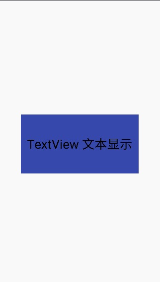

上面的`TextView`使用如下的几个常用的属性：

- id：为TextView在当前布局中设置一个唯一标识，我们可以在Java代码中通过 findViewById() 方法来获取到该对象。
- layout_width:TextView 的宽度。可以指定具体的宽度值；也可以自适应wrap_content；或者match_parent，宽度与父容器一样宽。
- layout_height:TextView的高度。可以指定具体的高度值；也可以自适应wrap_content；或者match_parent，宽度与父容器一样高。
- gravity：设置TextView中文字的对齐方向
- text：设置TextView里显示的文字
- textColor:设置文字的颜色
- textSize：设置文字的大小，通常使用sp作为单位
- background：设置TextView背景色

以上的一些属性，还可以在Java中设置：

```java
TextView textView = findViewById(R.id.tv_text);
textView.setId(0x0011);
textView.setText("TextView 文本显示");
textView.setBackgroundColor(Color.BLUE);
textView.setTextColor(Color.BLACK);
textView.setGravity(Gravity.CENTER);
```

#### 带有drawable的TextView

TextView提供了四个属性，可以在TextView上、下、左、右四个方向设置一些简单的drawable。

**drawableTop、drawableBottom、 drawableLeft、drawableRight** 四个属性分别可以设置上、下、左、右四个方向上的drawable，如下：

```xml
<TextView
    android:id="@+id/tv_text"
    android:layout_width="wrap_content"
    android:layout_height="wrap_content"
    android:layout_centerInParent="true"
    android:background="#3F51B5"
    android:drawableLeft="@drawable/ic_launcher_round"
    android:drawableTop="@drawable/ic_launcher_round"
    android:drawableRight="@drawable/ic_launcher_round"
    android:drawableBottom="@drawable/ic_launcher_round"
    android:drawablePadding="5dp"
    android:gravity="center"
    android:text="TextView 文本显示"
    android:textColor="@android:color/black"
    android:textSize="16sp" />
```

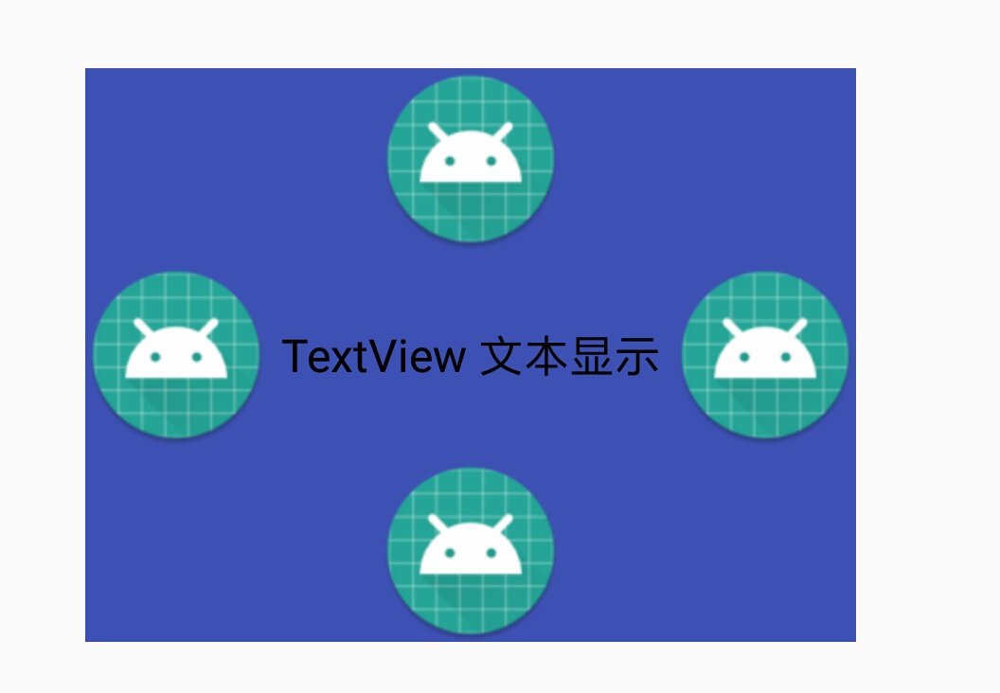

我们使用 drawableTop/Bottom/Left/Right 可以设置上下左右的标，可以使用 **drawablePadding** 设置图标距离文字的距离。但是无法控制它的大小。那么怎么才能修改呢？我们需要使用到 Java 代码：

```java
TextView textView = findViewById(R.id.tv_text);
// 这个数组表示 左，上，右，下 四个方向的图标，如果没有图标，则会返回空
Drawable[] drawables = textView.getCompoundDrawables();
Drawable leftDrawable = drawables[0];
// 通过setBounds 指定图标的位置和大小
leftDrawable.setBounds(50,50,100,100);
```

效果图：

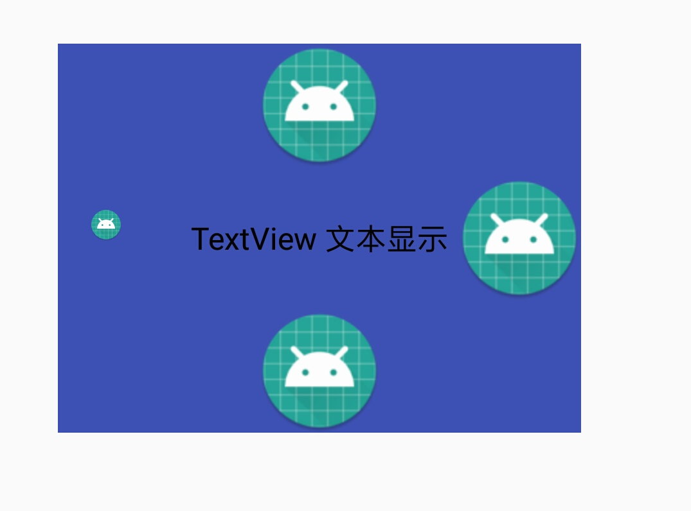

我们通过Drawable.setBounds()方法设置的左边的drawalbe的位置和大小。Drawable.setBounds()中的4个参数表示图标所在区域的坐标方位和宽高。

在Java中可以通过TextView.setCompoundDrawables()方法设置TextView 的左上右下的图标：

```java
TextView textView = findViewById(R.id.tv_text);
Drawable drawable = getResources().getDrawable(R.drawable.ic_launcher);
// 必须设置drawable的位置和大小
drawable.setBounds(0,0,100,100);
// 如果没有要设置的drawable,可以传 null
textView.setCompoundDrawables(drawable, drawable, drawable, null);
```

效果如图：

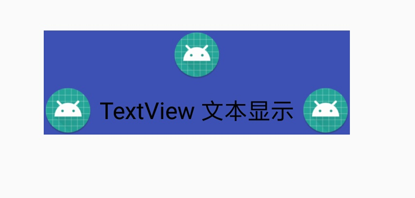

### Span

Span 是用于在Android中设置文本样式。Span是标记对象，它可以附着在一些文本上，比如一些短语或者一些文本段落。

Span只是Android开发中的一个概念，并不是一个类，或者是一个接口；TextView可以显示文字，图片；显示文字时也有多有少，有时可能要控制某一个段落的文字的样式；也有时要控制某几个字符的文本格式或者是修改文本的外观；甚至有时还要对文字的大小等进行修改，这些操作都可以通过Span来实现。

Span可以实现以下功能：

1. 改变文本中某些字符的颜色；
2. 使某些字符可点击；
3. 缩放某些字符的大小；
4. 自定义要点符号；
5. 在Canvas 上画图时，Span可以改变 `TextPaint`的属性，甚至可以改变文本的布局和文本的行高。

#### 单一样式

在TextView XML 属性中提供了 `typeStyle` ，可以修改整个TextView 的样式，它提供了三个选项值;

- italic ：斜体
- bold ：粗体
- normal ：默认普通字体

如果不设置`typeStyle`会默认为 `normal`,  三种属性值，也可以互相搭配使用，比如 `italic|bold`则表现为粗斜体。

#### 多样式

##### 使用HTML

Android 中提供了 `Html` 类 可以解析一些简单的 html 标签。解析后TextView 就会将其展示到界面上。比如：

```java
String text = "我想说两句 <font color='red'>第一句</font> <br> <font color='blue'>第二句</font>";
mTvHtml.setText(Html.fromHtml(text));
```

其中，`<font>` 可以规定文本的字体大小和颜色(这里如果设置字体大小是不起作用的，可以使用`<big>`替代) ；`<br>` 表示换行；`<strong>`给字体加粗 。

用来表示显示形式如下：

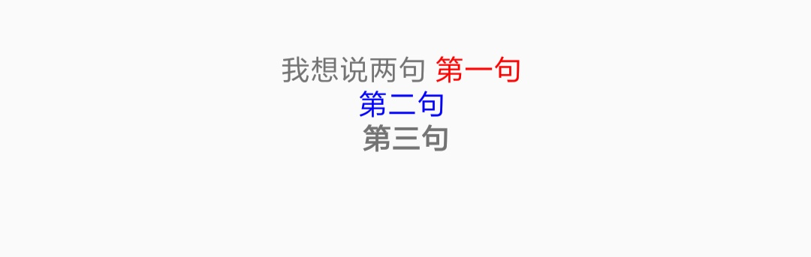

Html 目前仅支持一部分标签的解析，大概有以下部分标签：

| `<a>`   | `<b>`   | `<big>`    | `<blockquote>` | `<br/>` | `<cite>` |
| ------- | ------- | ---------- | -------------- | ------- | -------- |
| `<dfn>` | `<div>` | `<small>`  | `<font>`       | `<i>`   | ``  |
| `<h1>`  | `<h2>`  | `<h3>`     | `<h4>`         | `<h5>`  | `<h6>`   |
| `<p>`   | `<em>`  | `<strike>` | `<strong>`     | `<sub>` | `<sup>`  |
| `<tt>`  | `<u>`   | `<ul>`     | `<li>`         | `<del>` |          |

#### Span

虽然通过 `Html`类可以将HTML标签解析到TextView上进行显示，但是`Html`并不能支持所有的 HTML 标签和CSS 样式。所以我们就需要使用到 `Span`。

比如，TextView 展示 HTML 的内容，其实是将其解析成多个不同的 `Spanned ` 对象。`Spanned `是一个接口，它继承自 `CharSequence`，它用来标记文本中的范围，比如字符串中使用到了``标签，`Html` 就会将``范围内的内容解析成 `ImageSpan`。

在使用Span之前，必须知道下面的三个类：

- SpannedString：标记范围和内容都不可变；只可以用来展示。
- SpannableString：标记范围和内容都不可变，但是可以移除标记
- SpannableStringBuilder：标记范围和内容都可变

这里的标记范围是指，我们想改变其表现形式的内容范围，比如：我想把某个字符串的第1个到第5个字符改成红色。也可以通过String类就行类比一下。最后的 SpannableStringBuilder 可以类比 StringBuilder。

上面的三个类都是实现了`Spanned`接口。不过SpannableString和SpannableStringBuilder还实现了`Spannable`接口。

- Spanned：文本不可变，标记范围不可变
- Spannable：文本不可变，标记范围可变

所以实现了 Spannable 的 SpannableString和SpannableStringBuilder是可变的。它们可以通过 `setSpan(Object what, int start, int end, int flags)`，来设置标记的范围。

在显示开发中 SpannedString 基本上用不到，SpannableString和SpannableStringBuilder用到比较多。

##### SpannedString 用法

```java
String text = "我想说两句第一句第二句第三句";
SpannedString spannedString = new SpannedString(text);
mTvSpans.setText(spannedString);
```

其展示效果跟直接使用TextView.setText(text)没有什么区别。不过它还有一个跟 String.substring(int start,int end) 类似的功能，可以截取一部分字符进行显示。如果需要使用这个功能可以调用SpannedString.subSequence(int start,int end)，其用法跟String.substring(start, end)类似，这里不做单独讲解。

##### SpannableString 用法

```java
String text = "我想说两句第一句第二句第三句";
SpannableString spannableString = new SpannableString(text);
spannableString.setSpan(new ForegroundColorSpan(Color.RED), 1, 5,
                        Spannable.SPAN_EXCLUSIVE_EXCLUSIVE);
mTvSpans.setText(spannableString);
```

关于 `ForegroundColorSpan` ，它用来改变文本的前景色；对应还有个`BackgroundColorSpan`，用来改变文本的背景色。其展示效果如下：

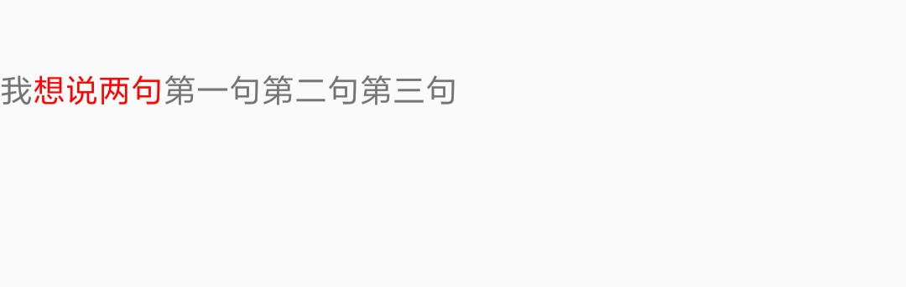

上面说过，SpannedString 的标记可变，所以我们可以给 SpannedString 设置多个span：

```java
String text = "我想说两句第一句第二句第三句";
SpannableString spannableString = new SpannableString(text);
spannableString.setSpan(new ForegroundColorSpan(Color.RED), 0, 5,
                        Spannable.SPAN_EXCLUSIVE_EXCLUSIVE);

spannableString.setSpan(new BackgroundColorSpan(Color.GREEN), 3, 7,
                        Spannable.SPAN_EXCLUSIVE_EXCLUSIVE);
mTvSpans.setText(spannableString);
```

展示效果：

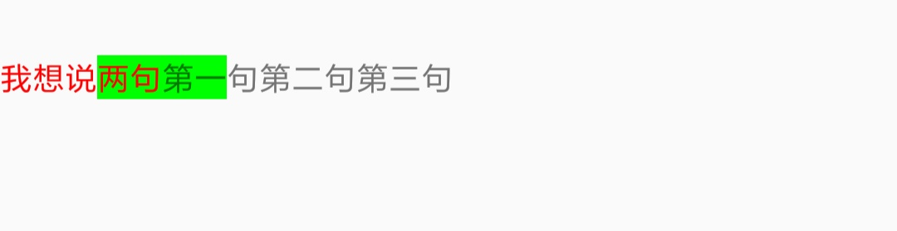

我们可以看到我们分别使用到了前景色和背景色，即两个span。**这说明多个span可以同时附着在同一段文字上**。

##### SpannableStringBuilder 用法

```java
String text = "我想说两句第一句第二句第三句";
SpannableStringBuilder spannableStringBuilder = new SpannableStringBuilder(text);
spannableStringBuilder.setSpan(new BackgroundColorSpan(Color.GREEN), 5, 8,
                               Spannable.SPAN_INCLUSIVE_INCLUSIVE);
mTvSpans.setText(spannableStringBuilder);
```

基本的用法跟上面的SpannableString用法一样；但是SpannableStringBuilder不仅可以span可变，而且内容也是可变的，比如：

```java
String text = "我想说两句第一句第二句第三句";
SpannableStringBuilder spannableStringBuilder = new SpannableStringBuilder(text);
spannableStringBuilder.setSpan(new BackgroundColorSpan(Color.GREEN), 5, 8,
                               Spannable.SPAN_INCLUSIVE_INCLUSIVE);
spannableStringBuilder.insert(5,"\n");
mTvSpans.setText(spannableStringBuilder);
```

效果如下：

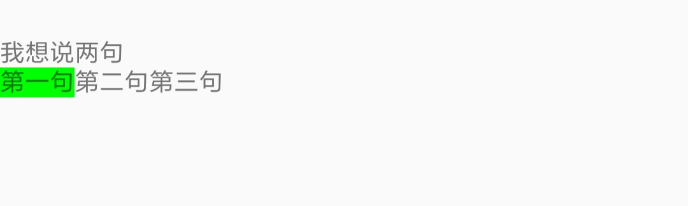

我们在第5个字符前面插入了一个换行符，改变了内容。

###### insert

`SpannableStringBuilder.insert(int where, CharSequence tb)` 这个方法可以在任意的位置插入任意的字符串。**当使用 insert 插入内容后，标记的点就转移，结束点后会后移，所以我们如果要在结束点插入内容，也需要需要相应的后移。所以需要再次计算结束点的时候需要注意**。

###### append

  `SpannableStringBuilder.insert(int where, CharSequence tb)`，可以在任意位置插入数据，而 `append` 可以在末尾追加数据，同时也可以指定追加内容的 `span`。它有以下的几个重载：

- append(CharSequence text) ：直接在末尾追加文字内容
- append(CharSequence text, Object what, int flags)：在末尾追加内容的同时，可以指定  `span`
- append(CharSequence text, int start, int end)：可以指定 text 的追加范围。

具体的使用后面会有具体展示。


关于 `setSpan(Object what, int start, int end, int flags)`  的说明：

1. Object what ：标记范围内的字符的表现行为，比如：是给标记范围内内容加前景色、背景色还是图片表情等。
2. int start：标记范围的起始点，最小为0，**包含在标记范围之内**。
3. int end：标记范围的结束点，最小为0，**不包含在标记范围之内**。
4. int flags：这个是主要SpannableStringBuilder中使用，在SpannedString用的比较少，它主要用于指明新插入的内容是否应用当前行为。下面详细说明

###### flags 说明

这个值主要是为了控制span标记的行为。标记范围理论上是需要一个起始点和结束点，就是上面`setSpan()`方法中的 start 和 end 的标记范围，当调用`setSpan()`之后，我们如果需要再次调用`insert()`对其中字符串进行插入修改，`flags` 的值就会起到作用；如果插入内容在已经标记的范围之内或者之外,这个值基本不会有什么影响。但是如果插入内容在已经标记的范围的起始点或者结束点，这个时候这个标记行为根据 `flags` 值就会有变化。下面几种 `flags ` 取值的说明

- SPAN_INCLUSIVE_INCLUSIVE：第一个下划线后的 **INCLUSIVE** 是说明在标记的起始点插入内容会**沿用 `setSpan`的行为**，第二个下划线后的 **INCLUSIVE** 是说明在标记的结束点插入内容**会沿用 `setSpan`的行为**。
- SPAN_EXCLUSIVE_EXCLUSIVE：第一个下划线后的 **EXCLUSIVE** 是说明在标记的起始点插入内容**不会沿用 `setSpan`的行为**，第二个下划线后的 **EXCLUSIVE** 是说明在标记的结束点插入内容**不会沿用 `setSpan`的行为**。
- SPAN_INCLUSIVE_EXCLUSIVE：第一个下划线后的 **INCLUSIVE** 是说明在标记的起始点插入内容**会沿用 `setSpan`的行为**，第二个下划线后的 **EXCLUSIVE** 是说明在标记的结束点插入内容**不会沿用 `setSpan`的行为**。
- SPAN_EXCLUSIVE_INCLUSIVE：第一个下划线后的 **EXCLUSIVE** 是说明在标记的起始点插入内容**不会沿用 `setSpan`的行为**，第二个下划线后的 **INCLUSIVE** 是说明在标记的结束点插入内容**会沿用 `setSpan`的行为**。

下面我们看一下各个值得表现形式：

###### SPAN_INCLUSIVE_INCLUSIVE

```java
String text = "我想说两句第一句第二句第三句";
SpannableStringBuilder spannableStringBuilder = new SpannableStringBuilder(text);
spannableStringBuilder.setSpan(new BackgroundColorSpan(Color.GREEN), 5, 8,
                               Spannable.SPAN_INCLUSIVE_INCLUSIVE);
spannableStringBuilder.insert(5,"insert");
// 当使用 insert 插入内容后，标记的点就转移，结束点后会后移，所以我们如果要在结束点插入内容，也需要需要相应的后移
// 后移距离为 insert 的长度，即为 6 + 8 = 14
spannableStringBuilder.insert(14,"insert");
mTvSpans.setText(spannableStringBuilder);
```

展示如下：


代码中我们标记的行为是将文字背景色改为绿色，当设置 `SPAN_INCLUSIVE_INCLUSIVE` 后，我们在 `start` 位置 插入的内容将文字背景色改为绿色，说明沿用了 `setSpan()` 时设置的行为；在 `end` 位置插入的内容将文字背景色改为绿色，说明沿用了 `setSpan()` 时设置的行为。

###### SPAN_EXCLUSIVE_EXCLUSIVE

我们将上面代码中的 `flags` 改为 SPAN_EXCLUSIVE_EXCLUSIVE：

```java
String text = "我想说两句第一句第二句第三句";
SpannableStringBuilder spannableStringBuilder = new SpannableStringBuilder(text);
spannableStringBuilder.setSpan(new BackgroundColorSpan(Color.GREEN), 5, 8,
                               Spannable.SPAN_EXCLUSIVE_EXCLUSIVE);
spannableStringBuilder.insert(5,"insert");
// 当使用 insert 插入内容后，标记的点就转移，结束点后会后移，所以我们如果要在结束点插入内容，也需要需要相应的后移
// 后移距离为 insert 的长度，即为 6 + 8 = 14
spannableStringBuilder.insert(14,"insert");
mTvSpans.setText(spannableStringBuilder);
```

其表现形式就会变成这样：

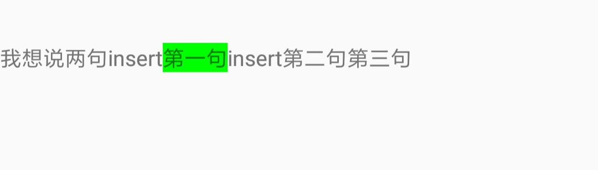

同样的代码中我们标记的行为是将文字背景色改为绿色，当设置 `SPAN_EXCLUSIVE_EXCLUSIVE` 后，我们在  `start` 位置 插入的内容文字背景色没有改变，说明 `setSpan()` 时设置的行为，并没有对其有影响；在 `end` 位置插入的内容文字背景色没有改变，说明 `setSpan()` 时设置的行为，并没有对其有影响。

###### SPAN_INCLUSIVE_EXCLUSIVE

```java
String text = "我想说两句第一句第二句第三句";
SpannableStringBuilder spannableStringBuilder = new SpannableStringBuilder(text);
spannableStringBuilder.setSpan(new BackgroundColorSpan(Color.GREEN), 5, 8,
                               Spannable.SPAN_INCLUSIVE_EXCLUSIVE);
spannableStringBuilder.insert(5,"insert");
// 当使用 insert 插入内容后，标记的点就转移，结束点后会后移，所以我们如果要在结束点插入内容，也需要需要相应的后移
// 后移距离为 insert 的长度，即为 6 + 8 = 14
spannableStringBuilder.insert(14,"insert");
mTvSpans.setText(spannableStringBuilder);
```

我们将 `flags` 改为 `SPAN_INCLUSIVE_EXCLUSIVE`，其表现形式如下：

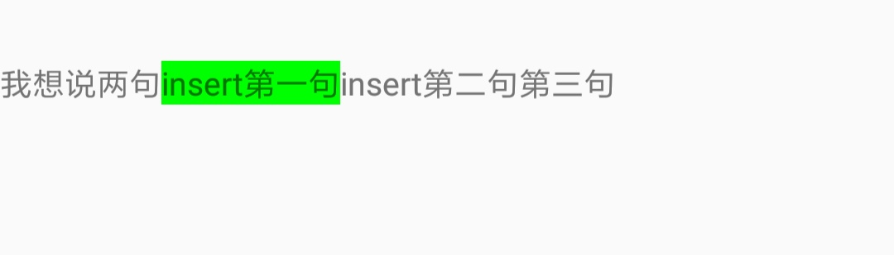

同样的代码中我们标记的行为是将文字背景色改为绿色，当设置 `SPAN_INCLUSIVE_EXCLUSIVE` 后，我们在  `start` 位置 插入的内容将文字背景色改为绿色，说明沿用了 `setSpan()` 时设置的行为；在 `end` 位置插入的内容文字背景色没有改变，说明 `setSpan()` 时设置的行为，并没有对其有影响。。

###### SPAN_EXCLUSIVE_INCLUSIVE

```java
String text = "我想说两句第一句第二句第三句";
SpannableStringBuilder spannableStringBuilder = new SpannableStringBuilder(text);
spannableStringBuilder.setSpan(new BackgroundColorSpan(Color.GREEN), 5, 8,
                               Spannable.SPAN_EXCLUSIVE_INCLUSIVE);
spannableStringBuilder.insert(5,"insert");
// 当使用 insert 插入内容后，标记的点就转移，结束点后会后移，所以我们如果要在结束点插入内容，也需要需要相应的后移
// 后移距离为 insert 的长度，即为 6 + 8 = 14
spannableStringBuilder.insert(14,"insert");
mTvSpans.setText(spannableStringBuilder);
```

我们将 `flags` 改为 `SPAN_EXCLUSIVE_INCLUSIVE`，其表现形式如下：

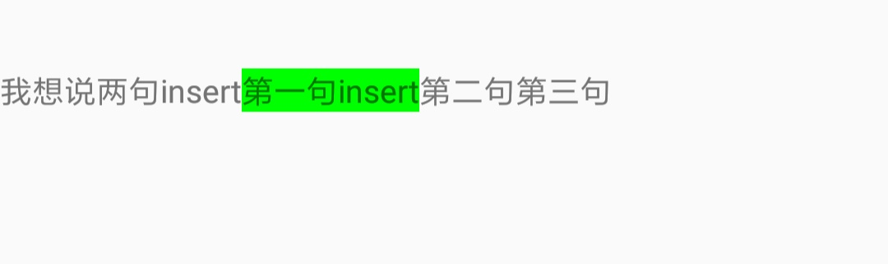

同样的代码中我们标记的行为是将文字背景色改为绿色，当设置 `SPAN_EXCLUSIVE_INCLUSIVE` 后，我们在  `start` 位置 插入的内容文字背景色没有改变，说明 `setSpan()` 时设置的行为，并没有对其有影响；在 `end` 位置插入的内容将文字背景色改为绿色，说明沿用了 `setSpan()` 时设置的行为。


下面介绍几个常用的 Span。

ForegroundColorSpan 和 BackgroundColorSpan上面的例子中已经有了，就不在赘述。

##### BulletSpan

这是一个给段落设置要点符号的Span。但是它的附着范围必须是在一整段，否则要点符号不会生效，但是第一段会有个缩进。

BulletSpan 允许的指定下面的选项：

- gapWith：要点符号距离文字段落的距离，单位像素，默认为 2px。
- color：要点符号的颜色，如果不指定则为TextView文字的颜色。
- bulletRadius：要点符号的半径，单位像素，默认为4px，(在api28添加)

```java
String text = "我想说两句\n";
int gapWidth = 10;
int color = Color.RED;
SpannableStringBuilder builder = new SpannableStringBuilder(text);
String first = "第一句\n";
builder.append(first, new BulletSpan(gapWidth, color), Spannable.SPAN_EXCLUSIVE_EXCLUSIVE);
String second = "第二句";
builder.append(second, new BulletSpan(gapWidth, color), Spannable.SPAN_EXCLUSIVE_EXCLUSIVE);
mTvBulletSpan.setText(builder);
```

看具体展示形式：

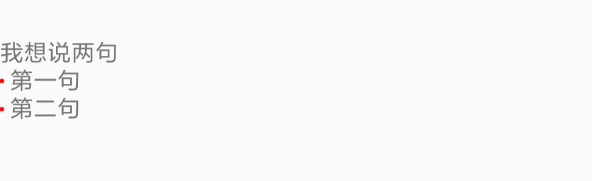

我们可以看见在第二行和第三行行首有两个红色的要点符号。

##### ClickableSpan

这是一个可点击的Span，如果我们把这个Span附着在TextView上，它可以实现TextView文字的局部点击。这样 ClickableSpan 就相当于是TextView 中的一个链接 。这个是一个抽象类，需要我们自己去实现点击的效果。

微信朋友圈展示已点赞的朋友列表就可以使用ClickableSpan来实现。下面看代码：

```java
    /**
     * ClickableSpan 为抽象类，所以我们需要先实现它未未实现的方法。
     */
    private class FriendClickSpan extends ClickableSpan {
        private String mFriend;
        public FriendClickSpan(String friend) {
            mFriend = friend;
        }
        /**
         * 点击指定Span执行的操作，在这里实现。
         * @param widget TextView
         */
        @Override
        public void onClick(@NonNull View widget) {
            if (TextUtils.isEmpty(mFriend)) {
                return;
            }
            Toast.makeText(mContext, mFriend, Toast.LENGTH_SHORT).show();
    }
```

上面就是为了TextView实现局部点击而实现的ClickableSpan，接下来看 TextView 展示代码：

```java 
String[] friends = {"Tom", "Jack", "Ricky", "Tony", "Robin", "周冬雨", "薇薇", "程序亦非猿", "Mr.S", "StarkSong", "Larry"};

SpannableStringBuilder builder = new SpannableStringBuilder();
int len = friends.length;
for (int i = 0; i < len; i++) {
    String friend = friends[i];

    if (!TextUtils.isEmpty(friend)) {
        if (i < len - 1) {
            friend += "，";
        }
        builder.append(friend, new FriendClickSpan(friends[i]),
                       Spannable.SPAN_EXCLUSIVE_EXCLUSIVE);
    }
}
// 设置文字颜色为 蓝色
mTvClickableSpan.setTextColor(Color.BLUE);
mTvClickableSpan.setMovementMethod(LinkMovementMethod.getInstance());
mTvClickableSpan.setText(builder);
```

我们将一些朋友的名字，以ClickableSpan的形式添加到SpannableStringBuilder里，然后将其显示到TextView 上。下面看效果：

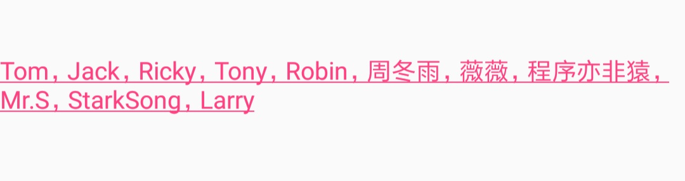

我们的目的是为了仿出朋友圈点赞的好友列表，但是我们明明给文字颜色设置了蓝色，但是为什么，但为什么会有个粉红色呢？原因是因为，我们设置链接的点击颜色，所以就默认使用了APP主题中的 colorAccent ，看下图你就会有一种似曾相识的感觉:

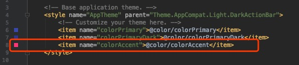

对，就是我么在新建项目的时候，默认生成的主题验颜色。如果不想要粉红色，就可以更改这个颜色。但是我们不想改colorAccent，又要把文字改成蓝色怎么办呢？TextView有个属性叫做 `setLinkTextColor` ，我们在代码中添加一行这个代码就OK：

```java
mTvClickableSpan.setLinkTextColor(Color.BLUE);
```

如果仔细看一下，就会发现，文字还有一条下划线，这个是 `ClickableSpan` 默认给加上了，如果需要去掉，就需要重写它的一个方法 `updateDrawState`，它本来实现如下：

```java
@Override
public void updateDrawState(@NonNull TextPaint ds) {
   // ClickableSpan 中文字显示的文字颜色，这里为链接的颜色，即 colorAccent
    ds.setColor(ds.linkColor);
   // 添加下滑线
    ds.setUnderlineText(true);
}
```

如果我们需要去掉下滑线，重写这个方法，把 `true` 改成 `false` 就可以去掉下滑线。

这样就可以达到下面的效果：

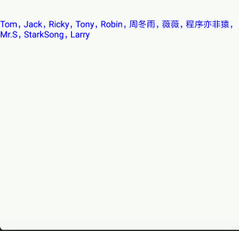

但是当我们点击的时候会有粉红色的背景，这个怎么解决呢？我们可以通过设置TextView的高亮显示的颜色，来解决。

```java
String[] friends = {"Tom", "Jack", "Ricky", "Tony", "Robin", "周冬雨", "薇薇", "程序亦非猿", "Mr.S", "StarkSong", "Larry"};

        SpannableStringBuilder builder = new SpannableStringBuilder();
        int len = friends.length;
        for (int i = 0; i < len; i++) {
            String friend = friends[i];

            if (!TextUtils.isEmpty(friend)) {
                if (i < len - 1) {
                    friend += "，";
                }
                builder.append(friend, new FriendClickSpan(friends[i]),
                               Spannable.SPAN_EXCLUSIVE_EXCLUSIVE);
            }
        }
        // 设置文字颜色为 蓝色
        mTvClickableSpan.setTextColor(Color.BLUE);
        // 设置链接颜色
        mTvClickableSpan.setLinkTextColor(Color.BLUE);
        // 设置高亮显示颜色,这里设置透明色
        mTvClickableSpan.setHighlightColor(Color.TRANSPARENT);
        mTvClickableSpan.setMovementMethod(LinkMovementMethod.getInstance());
        mTvClickableSpan.setText(builder);
```

```java
/**
 * ClickableSpan 为抽象类，所以我们需要先实现它未未实现的方法。
 */
private class FriendClickSpan extends ClickableSpan {

    private String mFriend;

    public FriendClickSpan(String friend) {
        mFriend = friend;
    }

    @Override
    public void updateDrawState(@NonNull TextPaint ds) {
        ds.setUnderlineText(false);
    }

    /**
     * 点击指定Span执行的操作，在这里实现。
     *
     * @param widget TextView
     */
    @Override
    public void onClick(@NonNull View widget) {
        if (TextUtils.isEmpty(mFriend)) {
            return;
        }

        Toast.makeText(mContext, mFriend, Toast.LENGTH_SHORT).show();
    }
}
```

看下面的效果：

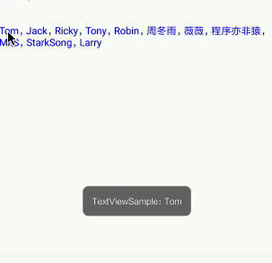

##### ImageSpan

 这个Span可以将字符串中的某些字符替换成 Drawable。使用这个Span时需要一个占位符。我们可以把占位符替换成我们指定的图。

下面我们在TextView上显示一个黑色的空心：

```java
String imagePlaceholder = "[heart]";
SpannableStringBuilder builder = new SpannableStringBuilder(imagePlaceholder);
// 指定 图片的路径
ImageSpan imageSpan = new ImageSpan(mContext,R.drawable.icon_favorite);
builder.setSpan(imageSpan, 0, imagePlaceholder.length(),
                Spannable.SPAN_EXCLUSIVE_EXCLUSIVE);
mTvImageSpan.setText(builder);
```

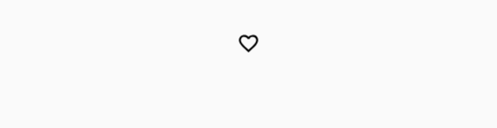

这里默认的对齐方式为：ALIGN_BOTTOM，我们也可以在构造函数里设置对齐方式为ALIGN_BASELINE。如果需要其它的对齐方式，就需要重写ImageSpan的`getDrawable`来对对齐方式进行修改。

接上面的仿微信朋友圈的好友点赞列表，我们已经实现列表的显示，但是没有前面心形，我们这里就可以通过ImageSpan添加到队首。

```java
				String[] friends = {"Tom", "Jack", "Ricky", "Tony", "Robin", "周冬雨", "薇薇", "程序亦非猿", "Mr.S", "StarkSong", "Larry"};

        // 添加心形
        String imagePlaceholder = "[heart]";
        SpannableStringBuilder builder = new SpannableStringBuilder(imagePlaceholder);
        ImageSpan imageSpan = new ImageSpan(mContext,R.drawable.icon_favorite);
        builder.setSpan(imageSpan, 0, imagePlaceholder.length(),
                        Spannable.SPAN_EXCLUSIVE_EXCLUSIVE);

        int len = friends.length;
        for (int i = 0; i < len; i++) {
            String friend = friends[i];

            if (!TextUtils.isEmpty(friend)) {
                if (i < len - 1) {
                    friend += "，";
                }
                builder.append(friend, new FriendClickSpan(friends[i]),
                               Spannable.SPAN_EXCLUSIVE_EXCLUSIVE);
            }
        }
        // 设置文字颜色为 蓝色
        mTvFriendLikeSpan
                .setTextColor(Color.BLUE);
        // 设置高亮显示颜色,这里设置透明色
        mTvFriendLikeSpan.setLinkTextColor(Color.BLUE);
        // 设置高亮显示颜色
        mTvFriendLikeSpan.setHighlightColor(Color.TRANSPARENT);
        mTvFriendLikeSpan.setMovementMethod(LinkMovementMethod.getInstance());
        mTvFriendLikeSpan.setText(builder);
```

我们看一下效果：

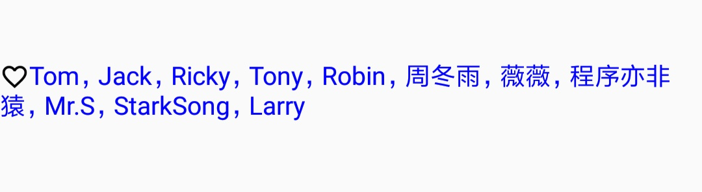

##### RelativeSizeSpan

它可以使字体大小均匀的缩放，它可以使附着上的文字以一定比例缩放，比如使标记范围内容的字体放大其它字体的1.5倍；或者缩小为其它字体的0.5倍。

```java
String text = "下面是重点:\n";
SpannableStringBuilder builder = new SpannableStringBuilder(text);
builder.append("重点一\n", new RelativeSizeSpan(1.5f),Spannable.SPAN_EXCLUSIVE_EXCLUSIVE);
builder.append("重点二\n", new RelativeSizeSpan(1.5f),Spannable.SPAN_EXCLUSIVE_EXCLUSIVE);
builder.append("重点三\n", new RelativeSizeSpan(0.5f),Spannable.SPAN_EXCLUSIVE_EXCLUSIVE);
mTvRelativeSizeSpan.setText(builder);
```

 效果如下：

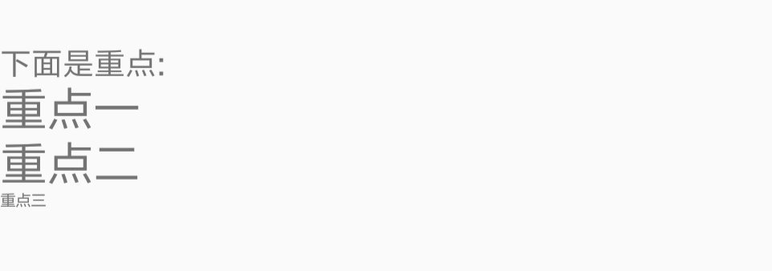

##### SubscriptSpan

这是一个可以移动文字的baseline的下移的Span，我们可以通过它设置一些公式的下标。

```java
String text = "下面是水的分子式:\nH";
SpannableStringBuilder builder = new SpannableStringBuilder(text);
builder.append("2", new SubscriptSpan(), Spannable.SPAN_EXCLUSIVE_EXCLUSIVE);
builder.append("O");
mTvSubscriptSpan.setText(builder);
```

效果如下：

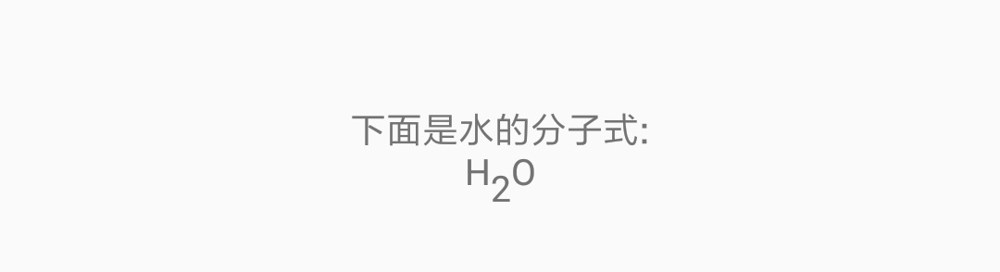

上面是下标的表现形式，对应的还有表示右上标的 `SuperscriptSpan`，其使用方式跟`SubscriptSpan` 一样，这里据不在赘述。


#### Span 分类

上面简单介绍了一下常用的几个Span，Android 还提供了很多其它的Span。它们都躺在 `android.text.style` 包下。如果要分类的话，可以根据两个方面分类。

- 改变文本的外观，还是改变的文本的布局和度量标准。
- 改变文字的数量是字符级，还是段落级。

虽然可以按上面的规则分类，但是它们又会互相纠缠。

##### 外观 VS 度量

Span 对外观的影响很多理解，比如可以修改文字颜色、背景颜色、下滑线、删除线等等。它们影响是字符级的文字。它们触发重绘时并不会使文字的重新进行布局。它们都实现了 `UpdateAppearance`接口并且继承了`CharacterStyle`类，`CharacterStyle`的子类会定义如何通过`TextPaint`绘制文字。当然并不是所有的子类有权限访问 `TextPaint`。下面是相关的类图：


Span 对布局和度量标准的影响主要表现在重绘时会重新计算文字的位置并且重新进行渲染。比如上面的 `SubscriptSpan`，它降低了文字的 baseline，当我们设置`SubscriptSpan`后，`TextView`会进行重绘，并且需要计算标记范围内的文字位置。相关的Span会继承`MetricAffectingSpan`，而抽象类`MetricAffectingSpan`又实现了 `UpdateAppearance`接口并且继承了`CharacterStyle`类。`MetricAffectingSpan`的子类会定义如何通过`TextPaint`绘制文字。这里也会控制子类访问 `TextPaint`的权限。这下面是相关的类图：


##### 字符级 VS 段落级

有的Span影响范围在字符级，它可以更新标记范围内的元素的背景色，风格或者是尺寸。有的Span影响范围在段落级，它可以改变标记范围内的元素的对齐方式。这些Span根据影响范围分别继承 `CharacterStyle`或实现`ParagraphStyle`。如果影响范围在段落级，实现了 `ParagraphStyle`，标记的范围必须从该段落的第一个字符到最后一个字符，否则会出现问题。Android 中的段落的以换行（\n）为准，比如`我想说两句\n第一句\n第二句\n第三句`，这里就有四个段落。

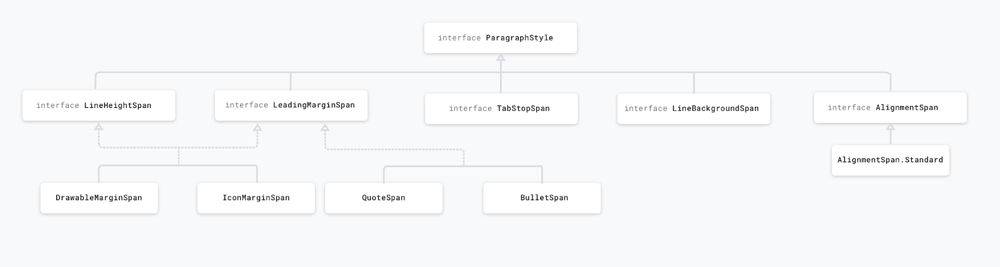

#### 自定义Span

如果我们做项目时遇到一些需求，已有的Span，并不能达到我们想要的效果，我们就需要自定义一个 Span 。为了更好为自定义 Span ，我们需要了解我们的Span的影响范围和等级。我们自定义的时候是只改变字符还是段落；还是要改变字符的绘制位置。下面是我们在自定义Span时需要继承的类或者需要实现的接口：

- *CharacterStyle*：字符级
- *ParagraphStyle*：段落级
- *UpdateAppearance*：外观
- *UpdateLayout*：布局和度量

当然我们不是所有的时候会直接实现上面的接口或者继承这些类，比如我们上面的ClickableSpan。如果有的Span  已经提供了大部分功能，我们只需添加或者更改它的部分功能就OK。


参考：

<https://medium.com/androiddevelopers/spantastic-text-styling-with-spans-17b0c16b4568>